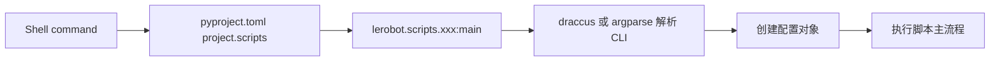

# LeRobot CLI Scripts Architecture

本文档目录解释 `pyproject.toml` 中 `[project.scripts]` 注册的所有命令入口。每个命令都有独立 Markdown 文件，重点看四件事：

- `pyproject.toml` 如何把命令映射到 Python `main()`
- CLI 参数如何进入 dataclass 或 argparse 配置
- 运行时如何创建 robot、teleoperator、dataset、policy、env、processor
- 主循环或一次性工具流程如何结束、保存、上传或清理资源

## 总体入口模型

`pyproject.toml` 的 `[project.scripts]` 是 Python console script 入口表。安装 LeRobot 后，命令行里的 `lerobot-train`、`lerobot-record` 等命令会被打包工具生成成可执行脚本，并转发到对应模块的 `main()`。

大多数训练、硬件、部署命令使用 `draccus.wrap()`，因此参数形态通常是 `--robot.type=so101_follower`、`--policy.path=...` 这种嵌套配置。少数纯工具脚本使用 `argparse`，例如 `lerobot-find-cameras`、`lerobot-dataset-viz`。

## 命令索引

| 命令 | 源码入口 | 文档 |
| --- | --- | --- |
| `lerobot-calibrate` | `lerobot.scripts.lerobot_calibrate:main` | [lerobot-calibrate.md](./lerobot-calibrate.md) |
| `lerobot-find-cameras` | `lerobot.scripts.lerobot_find_cameras:main` | [lerobot-find-cameras.md](./lerobot-find-cameras.md) |
| `lerobot-find-port` | `lerobot.scripts.lerobot_find_port:main` | [lerobot-find-port.md](./lerobot-find-port.md) |
| `lerobot-record` | `lerobot.scripts.lerobot_record:main` | [lerobot-record.md](./lerobot-record.md) |
| `lerobot-replay` | `lerobot.scripts.lerobot_replay:main` | [lerobot-replay.md](./lerobot-replay.md) |
| `lerobot-setup-motors` | `lerobot.scripts.lerobot_setup_motors:main` | [lerobot-setup-motors.md](./lerobot-setup-motors.md) |
| `lerobot-teleoperate` | `lerobot.scripts.lerobot_teleoperate:main` | [lerobot-teleoperate.md](./lerobot-teleoperate.md) |
| `lerobot-eval` | `lerobot.scripts.lerobot_eval:main` | [lerobot-eval.md](./lerobot-eval.md) |
| `lerobot-train` | `lerobot.scripts.lerobot_train:main` | [lerobot-train.md](./lerobot-train.md) |
| `lerobot-train-tokenizer` | `lerobot.scripts.lerobot_train_tokenizer:main` | [lerobot-train-tokenizer.md](./lerobot-train-tokenizer.md) |
| `lerobot-dataset-viz` | `lerobot.scripts.lerobot_dataset_viz:main` | [lerobot-dataset-viz.md](./lerobot-dataset-viz.md) |
| `lerobot-info` | `lerobot.scripts.lerobot_info:main` | [lerobot-info.md](./lerobot-info.md) |
| `lerobot-find-joint-limits` | `lerobot.scripts.lerobot_find_joint_limits:main` | [lerobot-find-joint-limits.md](./lerobot-find-joint-limits.md) |
| `lerobot-imgtransform-viz` | `lerobot.scripts.lerobot_imgtransform_viz:main` | [lerobot-imgtransform-viz.md](./lerobot-imgtransform-viz.md) |
| `lerobot-edit-dataset` | `lerobot.scripts.lerobot_edit_dataset:main` | [lerobot-edit-dataset.md](./lerobot-edit-dataset.md) |
| `lerobot-setup-can` | `lerobot.scripts.lerobot_setup_can:main` | [lerobot-setup-can.md](./lerobot-setup-can.md) |
| `lerobot-annotate` | `lerobot.scripts.lerobot_annotate:main` | [lerobot-annotate.md](./lerobot-annotate.md) |
| `lerobot-rollout` | `lerobot.scripts.lerobot_rollout:main` | [lerobot-rollout.md](./lerobot-rollout.md) |

## 命令分组

硬件现场调试：

- `lerobot-find-port`
- `lerobot-find-cameras`
- `lerobot-setup-motors`
- `lerobot-calibrate`
- `lerobot-teleoperate`
- `lerobot-find-joint-limits`
- `lerobot-setup-can`

数据采集与数据集维护：

- `lerobot-record`
- `lerobot-replay`
- `lerobot-dataset-viz`
- `lerobot-imgtransform-viz`
- `lerobot-edit-dataset`
- `lerobot-annotate`

模型训练、评估、部署：

- `lerobot-train`
- `lerobot-eval`
- `lerobot-train-tokenizer`
- `lerobot-rollout`

环境诊断：

- `lerobot-info`

