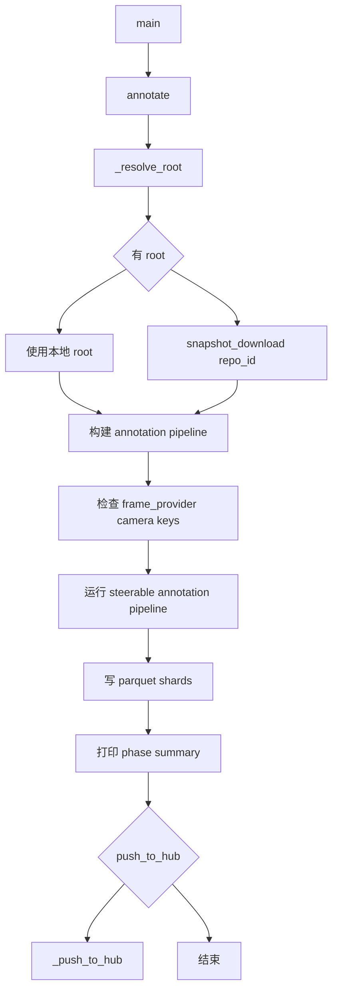
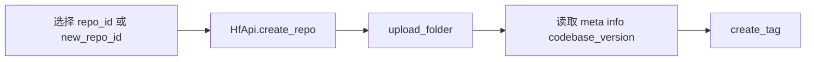

# lerobot-annotate 架构流程

## 入口

- CLI：`lerobot-annotate`
- `pyproject.toml` 映射：`lerobot.scripts.lerobot_annotate:main`
- 源码：`src/lerobot/scripts/lerobot_annotate.py`
- 配置：`AnnotationPipelineConfig`
- 参数解析：`draccus`

## 作用

`lerobot-annotate` 给 LeRobotDataset 写入语言标注列，主要包括 `language_persistent` 和 `language_events`。标注直接写入数据集的 parquet shard，例如 `data/chunk-*/file-*.parquet`。

## 顶层流程



## push_to_hub 流程



上传时会忽略 `.annotate_staging/**` 和系统临时文件。

## 架构要点

- 实际标注逻辑在 `lerobot.annotations.steerable_pipeline`。
- `_resolve_root()` 支持本地数据集，也支持从 Hub 下载 dataset repo。
- 如果启用了 VQA 模块但数据集没有 camera keys，会提前报错。
- 写入完成后会输出每个 phase 的 processed/skipped 统计。
- 上传后会尝试按数据集 `codebase_version` 打 tag，方便后续版本安全加载。

## 典型使用

```bash
lerobot-annotate \
  --root=/path/to/dataset \
  --push_to_hub=false
```

从 Hub 下载并写回：

```bash
lerobot-annotate \
  --repo_id=you/dataset \
  --push_to_hub=true \
  --new_repo_id=you/dataset_annotated
```

## 和 record 的关系

- `lerobot-record` 采集原始 observation/action/task。
- `lerobot-annotate` 在已有数据集上补充语言事件和持续语言描述。

