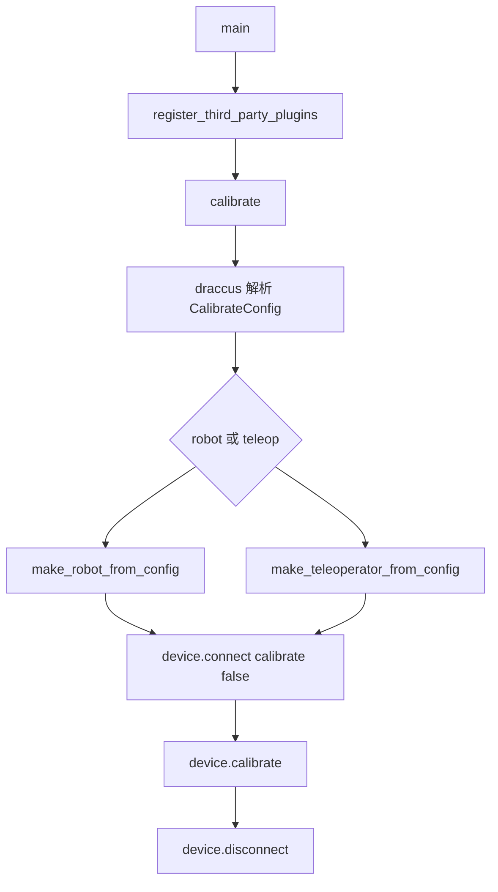

# lerobot-calibrate 架构流程

## 入口

- CLI：`lerobot-calibrate`
- `pyproject.toml` 映射：`lerobot.scripts.lerobot_calibrate:main`
- 源码：`src/lerobot/scripts/lerobot_calibrate.py`
- 参数解析：`draccus.wrap()`

## 作用

`lerobot-calibrate` 用来给一个 robot 或 teleoperator 执行标定。它不是训练命令，也不会读写数据集。它的职责很窄：实例化设备、连接设备、执行设备自己的 `calibrate()`，然后断开。

## 配置对象

核心配置是 `CalibrateConfig`：

- `robot: RobotConfig | None`
- `teleop: TeleoperatorConfig | None`

`__post_init__()` 要求二选一，不能同时传，也不能都不传。脚本会把选中的设备保存为 `device`，后续流程只面对统一的设备接口。

## 流程



## 架构要点

- 顶部导入了多类 robot 和 teleoperator 配置，目的是触发 draccus registry 注册。
- 第三方插件在 `main()` 中注册，因此外部包也可以扩展设备类型。
- `connect(calibrate=False)` 的含义是连接时不自动标定，把标定动作留给后面的 `device.calibrate()`。
- `finally` 中断开设备，避免标定过程中异常导致串口或硬件连接被占用。

## 典型使用

```bash
lerobot-calibrate \
  --robot.type=so101_follower \
  --robot.port=/dev/ttyACM0 \
  --robot.id=my_follower
```

或：

```bash
lerobot-calibrate \
  --teleop.type=so101_leader \
  --teleop.port=/dev/ttyACM1 \
  --teleop.id=my_leader
```

## 和其他命令的关系

- 通常在 `lerobot-setup-motors` 之后使用。
- 通常在 `lerobot-teleoperate`、`lerobot-record`、`lerobot-rollout` 之前使用。
- 如果标定文件已经存在，设备类内部会决定是否复用或覆盖。

