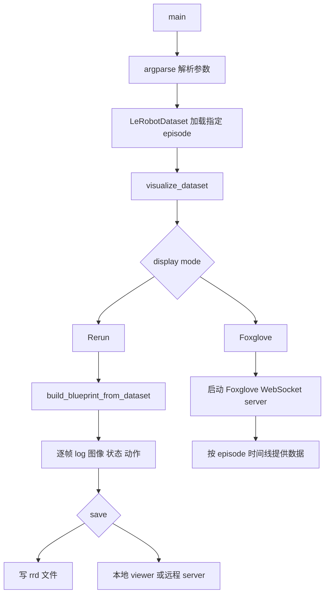

# lerobot-dataset-viz 架构流程

## 入口

- CLI：`lerobot-dataset-viz`
- `pyproject.toml` 映射：`lerobot.scripts.lerobot_dataset_viz:main`
- 源码：`src/lerobot/scripts/lerobot_dataset_viz.py`
- 参数解析：`argparse`

## 作用

`lerobot-dataset-viz` 可视化 LeRobotDataset 中某个 episode 的所有帧。它支持 Rerun 和 Foxglove 两种显示后端。

## 核心函数

- `get_feature_names()`：按 feature 类型提取列名。
- `check_chw_float32()`：校验图像 tensor 格式。
- `to_hwc_uint8_numpy()` / `to_hwc_float32_numpy()`：转换图像格式。
- `build_blueprint_from_dataset()`：为 Rerun 构建布局。
- `visualize_dataset()`：统一可视化主流程。
- `main()`：解析 CLI、加载 dataset、调用可视化。

## 流程



## Rerun 模式

Rerun 支持：

- `--mode=local`：本地 spawn viewer。
- `--mode=distant`：远端起 server，本地用 `rerun+http://.../proxy` 连接。
- `--save=1`：保存 `.rrd`，后续离线打开。

## Foxglove 模式

Foxglove 模式会启动 WebSocket server，episode 作为可 seek、可 scrub 的时间线提供给客户端。

参数上，Rerun 专用参数在 Foxglove 模式会被忽略并打印 warning。

## 典型使用

```bash
lerobot-dataset-viz \
  --repo-id=you/dataset \
  --episode-index=0 \
  --display-mode=rerun
```

保存 Rerun 文件：

```bash
lerobot-dataset-viz \
  --repo-id=you/dataset \
  --episode-index=0 \
  --save=1 \
  --output-dir=./viz
```

Foxglove：

```bash
lerobot-dataset-viz \
  --repo-id=you/dataset \
  --episode-index=0 \
  --display-mode=foxglove \
  --host=0.0.0.0 \
  --web-port=8765
```

