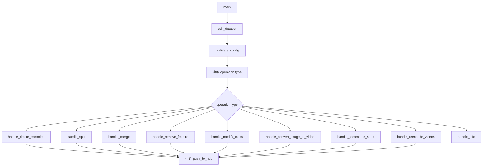

# lerobot-edit-dataset 架构流程

## 入口

- CLI：`lerobot-edit-dataset`
- `pyproject.toml` 映射：`lerobot.scripts.lerobot_edit_dataset:main`
- 源码：`src/lerobot/scripts/lerobot_edit_dataset.py`
- 配置：`EditDatasetConfig`
- 参数解析：`draccus`

## 作用

`lerobot-edit-dataset` 是 LeRobotDataset 的离线维护工具。它把不同数据集操作抽象成 `OperationConfig` registry，通过 `--operation.type=...` 选择具体操作。

## 顶层配置

`EditDatasetConfig`：

- `operation: OperationConfig`
- `repo_id: str | None`
- `root: str | None`
- `new_repo_id: str | None`
- `new_root: str | None`
- `push_to_hub: bool = False`

## Operation 类型

| operation type | 配置类 | 作用 |
| --- | --- | --- |
| `delete_episodes` | `DeleteEpisodesConfig` | 删除指定 episode |
| `split` | `SplitConfig` | 按比例或索引切分数据集 |
| `merge` | `MergeConfig` | 合并多个数据集 |
| `remove_feature` | `RemoveFeatureConfig` | 删除 feature 列 |
| `modify_tasks` | `ModifyTasksConfig` | 修改全局或 episode task |
| `convert_image_to_video` | `ConvertImageToVideoConfig` | 把 image 存储转成 video |
| `recompute_stats` | `RecomputeStatsConfig` | 重算 dataset stats |
| `reencode_videos` | `ReencodeVideosConfig` | 重编码视频 |
| `info` | `InfoConfig` | 打印数据集信息 |

## 分发流程



## 路径处理

脚本通过 `_resolve_io_paths()` 和 `get_output_path()` 统一决定输入输出路径：

- `repo_id/root` 描述输入数据集。
- `new_repo_id/new_root` 描述输出数据集。
- 当输入输出相同时，属于 in-place 修改，脚本会为原数据准备备份逻辑。

## 典型使用

查看信息：

```bash
lerobot-edit-dataset \
  --repo_id=you/dataset \
  --operation.type=info \
  --operation.show_features=true
```

删除 episode：

```bash
lerobot-edit-dataset \
  --repo_id=you/dataset \
  --new_repo_id=you/dataset_clean \
  --operation.type=delete_episodes \
  --operation.episode_indices='[3, 7, 10]'
```

重算统计：

```bash
lerobot-edit-dataset \
  --repo_id=you/dataset \
  --operation.type=recompute_stats \
  --operation.overwrite=true
```

## 架构要点

- operation 通过 `draccus.ChoiceRegistry` 注册，扩展新操作时新增 subclass 和 handler。
- 每个 handler 自己负责加载 `LeRobotDataset`、执行变换、保存输出。
- `push_to_hub=true` 会在操作完成后上传结果。
- 大操作如视频重编码、stats 重算可能耗时很长，建议先在小数据集上测试。

