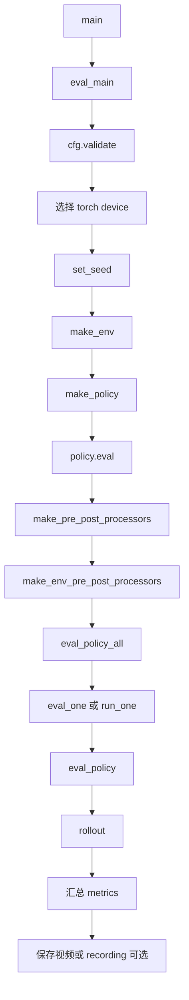
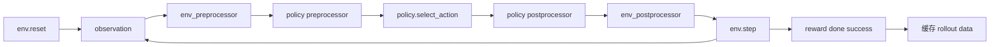

# lerobot-eval 架构流程

## 入口

- CLI：`lerobot-eval`
- `pyproject.toml` 映射：`lerobot.scripts.lerobot_eval:main`
- 源码：`src/lerobot/scripts/lerobot_eval.py`
- 顶层配置：`EvalPipelineConfig`
- 参数解析：`draccus` parser

## 作用

`lerobot-eval` 在仿真环境中评估 policy。它不是物理机器人部署工具；真实机器人部署使用 `lerobot-rollout`。eval 的核心是创建环境、加载 policy、运行多 episode rollout、汇总 reward/success/video 等指标。

## 顶层流程



## rollout 内部数据流



## 核心函数

- `rollout()`：对一批 env 跑一次 rollout，返回 observation、action、reward、done、success 等序列。
- `eval_policy()`：按 episode 数多次调用 rollout，裁剪 done 之后的数据，计算平均指标。
- `_compile_episode_data()`：把 rollout 数据整理成 Hugging Face dataset 格式。
- `eval_one()`：评估单个 task。
- `run_one()`：用于并发执行单 task eval。
- `eval_policy_all()`：多 task 汇总入口。

## 处理器层

eval 同时有两组 processor：

- policy processor：`make_pre_post_processors()`，把 env observation 转成 policy 输入，把 policy action 转成标准动作。
- env processor：`make_env_pre_post_processors()`，处理特定环境需要的格式，例如 LIBERO。

这两组 processor 让 policy 和 env 解耦。

## 输出

常见输出包括：

- per-task reward
- per-task success rate
- overall reward 和 success
- rollout video 路径
- 可选 recording dataset

如果 policy 支持 world model latent video，也可能保存预测视频。

## 典型使用

```bash
lerobot-eval \
  --policy.path=/path/to/checkpoint/pretrained_model \
  --env.type=pusht \
  --eval.n_episodes=50 \
  --eval.batch_size=10 \
  --output_dir=./outputs/eval
```

## 和 rollout 的区别

- `lerobot-eval` 面向仿真环境，依赖 `env.step()`。
- `lerobot-rollout` 面向真实机器人，依赖 `robot.get_observation()` 和 `robot.send_action()`。

