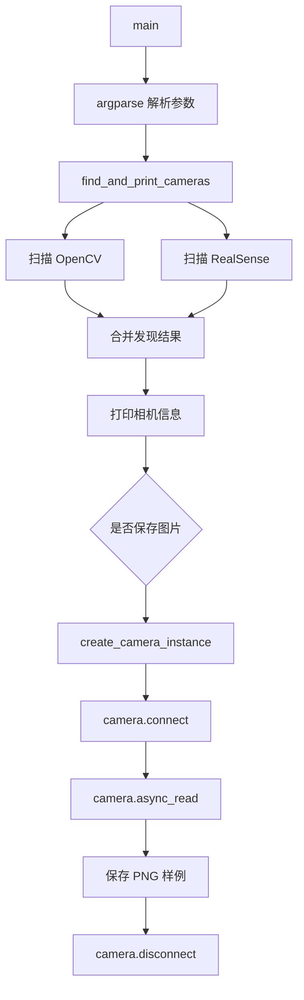

# lerobot-find-cameras 架构流程

## 入口

- CLI：`lerobot-find-cameras`
- `pyproject.toml` 映射：`lerobot.scripts.lerobot_find_cameras:main`
- 源码：`src/lerobot/scripts/lerobot_find_cameras.py`
- 参数解析：`argparse`

## 作用

`lerobot-find-cameras` 是相机发现与冒烟测试工具。它会扫描 OpenCV 相机和 RealSense 相机，打印检测到的设备信息，并可连接相机读取帧，保存样例图片到输出目录。

## 核心函数

- `find_all_opencv_cameras()`：扫描 OpenCV backend 可见的摄像头。
- `find_all_realsense_cameras()`：扫描 Intel RealSense 设备。
- `find_and_print_cameras()`：统一发现、过滤、打印。
- `create_camera_instance()`：根据发现结果创建相机对象。
- `process_camera_image()`：读取图像并准备保存。
- `save_images_from_all_cameras()`：并发连接相机、采样帧、保存图片。
- `cleanup_cameras()`：断开已经连接的相机。

## 流程



## 架构要点

- 这是一个纯工具脚本，不依赖 `RobotConfig`。
- OpenCV 和 RealSense 分开扫描，最后合并成统一的发现结果。
- 保存图片时会真实创建相机对象，所以它能验证“系统能看到相机”和“LeRobot 相机类能读取帧”两件事。
- 图像保存依赖 Pillow。
- 采样与保存使用线程池，避免多相机时串行等待太久。

## 常见用途

- 录数据前确认相机 index 或 serial。
- 确认 USB/驱动/权限是否正常。
- 拿到 `--robot.cameras="{...}"` 配置里需要填的相机标识。

## 典型使用

```bash
lerobot-find-cameras
```

只看某一类：

```bash
lerobot-find-cameras opencv
lerobot-find-cameras realsense
```

## 输出如何用于后续命令

发现相机后，把相机名称和参数放到 robot 配置里，例如：

```bash
--robot.cameras="{front: {type: opencv, index_or_path: 0, width: 640, height: 480, fps: 30}}"
```

具体字段取决于相机类型和对应的 camera config。

