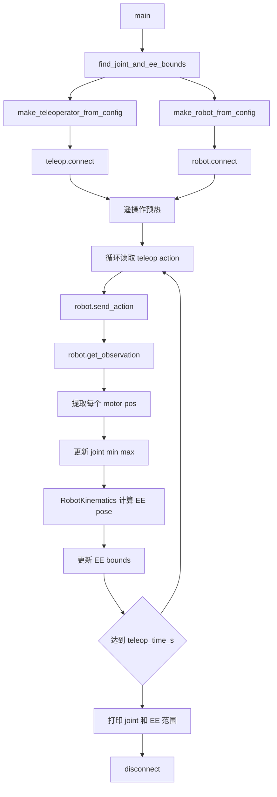

# lerobot-find-joint-limits 架构流程

## 入口

- CLI：`lerobot-find-joint-limits`
- `pyproject.toml` 映射：`lerobot.scripts.lerobot_find_joint_limits:main`
- 源码：`src/lerobot/scripts/lerobot_find_joint_limits.py`
- 参数解析：`draccus.wrap()`

## 作用

`lerobot-find-joint-limits` 通过遥操作让机器人运动，采集关节位置最小值、最大值，并结合 kinematics 估计末端执行器边界。它用于给安全范围、工作空间范围、后续控制约束提供参考。

## 配置对象

`FindJointLimitsConfig`：

- `teleop: TeleoperatorConfig`
- `robot: RobotConfig`
- `fps: int`
- `teleop_time_s: float = 30`

## 流程



## 架构要点

- 该脚本真实驱动机械臂，需要空旷安全空间。
- 它依赖 robot observation 中的 `*.pos` 字段。
- joint limits 是通过你手动探索得到的经验范围，不是机械硬限位。
- 末端边界依赖 `RobotKinematics`，机器人类型需要有可用的运动学模型。

## 典型使用

```bash
lerobot-find-joint-limits \
  --robot.type=so101_follower \
  --robot.port=/dev/ttyACM0 \
  --robot.id=my_follower \
  --teleop.type=so101_leader \
  --teleop.port=/dev/ttyACM1 \
  --teleop.id=my_leader \
  --teleop_time_s=30
```

## 输出怎么理解

- joint min/max：每个关节在本次人工运动中观测到的最小和最大位置。
- EE bounds：末端执行器在空间中的位置边界。
- 结果只覆盖你实际移动过的范围，所以探索不充分会导致范围偏小。

