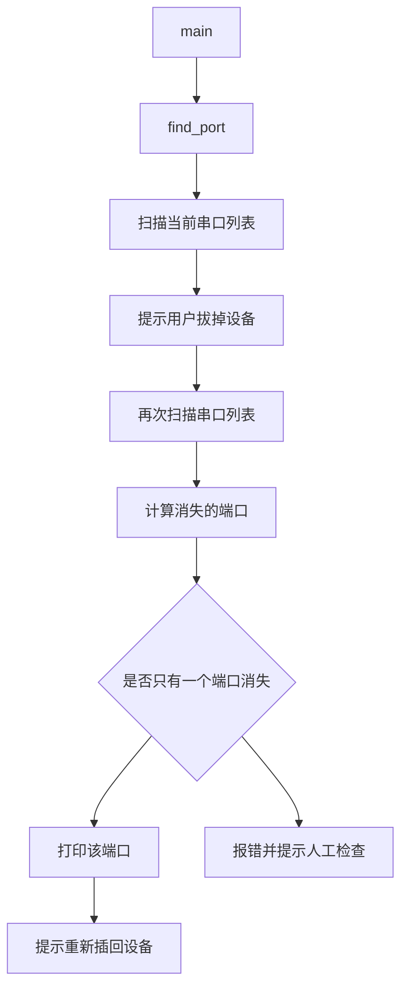

# lerobot-find-port 架构流程

## 入口

- CLI：`lerobot-find-port`
- `pyproject.toml` 映射：`lerobot.scripts.lerobot_find_port:main`
- 源码：`src/lerobot/scripts/lerobot_find_port.py`
- 参数解析：脚本内部交互式流程

## 作用

`lerobot-find-port` 用于找出机器人或遥操作器电机总线对应的串口。它通过“拔掉设备前后端口列表差异”判断设备端口。

## 核心函数

- `find_available_ports()`：列出当前系统可见串口。
- `find_port()`：引导用户拔插设备并计算端口差异。
- `main()`：命令入口。

## 流程



## 平台差异

- Windows：通过 `serial.tools.list_ports.comports()` 获取 `COM*`。
- Linux/macOS：匹配 `/dev/tty*`。
- 依赖 `pyserial`，没有安装时会提示安装相关依赖。

## 架构要点

- 它不连接 robot，也不读取电机协议，只看系统串口枚举。
- 判断依据是集合差异，因此最好一次只拔一个设备。
- 如果多个端口同时变化，脚本会拒绝猜测，要求重新操作。

## 典型使用

```bash
lerobot-find-port
```

得到端口后用于：

```bash
--robot.port=/dev/ttyACM0
--teleop.port=/dev/ttyACM1
```

Windows 上通常是：

```bash
--robot.port=COM3
```

