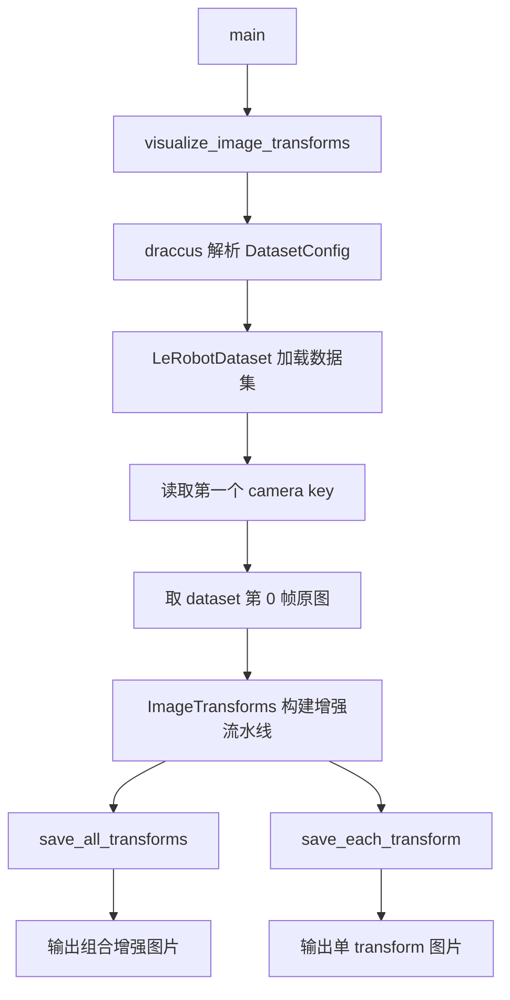

# lerobot-imgtransform-viz 架构流程

## 入口

- CLI：`lerobot-imgtransform-viz`
- `pyproject.toml` 映射：`lerobot.scripts.lerobot_imgtransform_viz:main`
- 源码：`src/lerobot/scripts/lerobot_imgtransform_viz.py`
- 配置：`DatasetConfig`
- 参数解析：`draccus.wrap()`

## 作用

`lerobot-imgtransform-viz` 从数据集中取一帧图像，展示 `ImageTransformsConfig` 下配置的图像增强效果。它既能保存组合增强结果，也能保存每个单独 transform 的效果。

## 核心函数

- `save_all_transforms()`：保存完整 transform pipeline 多次采样的结果。
- `save_each_transform()`：逐个 transform 保存单独效果。
- `visualize_image_transforms()`：加载 dataset、取第一帧、调用保存函数。
- `main()`：命令入口。

## 流程



## 架构要点

- 输入配置复用 dataset 配置中的 `image_transforms` 字段。
- 如果 `image_transforms.enable=False`，单 transform 输出会跳过。
- 默认取数据集第一个 camera key 的第一帧，因此它是可视化工具，不是全数据集批处理工具。
- 输出是图片文件，方便肉眼确认 crop、resize、color jitter 等增强是否合理。

## 典型使用

```bash
lerobot-imgtransform-viz \
  --repo_id=you/dataset \
  --image_transforms.enable=true
```

可以通过 CLI 覆盖具体 transform 参数，具体字段取决于 `ImageTransformsConfig`。

## 使用场景

- 训练前确认增强不会裁掉关键物体。
- 对比不同相机分辨率下增强结果。
- 调试 policy 输入图像预处理链路。

