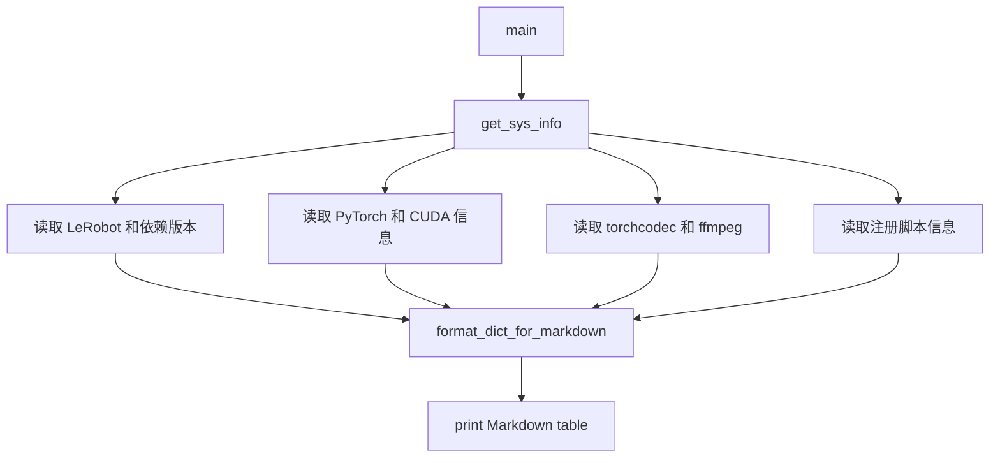

# lerobot-info 架构流程

## 入口

- CLI：`lerobot-info`
- `pyproject.toml` 映射：`lerobot.scripts.lerobot_info:main`
- 源码：`src/lerobot/scripts/lerobot_info.py`
- 参数解析：无复杂参数

## 作用

`lerobot-info` 打印当前 LeRobot 运行环境信息，方便排查 issue。输出格式是 Markdown 表格，适合直接粘贴到 bug report。

## 核心函数

- `get_ffmpeg_version()`：读取 ffmpeg 版本。
- `get_package_version(package_name)`：动态 import 包并读取版本。
- `get_sys_info()`：汇总系统、Python、PyTorch、CUDA、包版本和脚本信息。
- `format_dict_for_markdown()`：把 dict 格式化成 Markdown 表格。
- `main()`：打印结果。

## 流程



## 架构要点

- 这是诊断工具，不修改环境。
- 包版本通过 import 检测，缺失包显示为 `N/A`。
- PyTorch 信息包括 CUDA 是否可用、CUDA build、GPU 数量等。
- ffmpeg 通过执行命令读取，失败时返回不可用信息。

## 典型使用

```bash
lerobot-info
```

排查 GPU 时，这个命令常和下面命令一起用：

```bash
nvidia-smi
python - <<'PY'
import torch
print(torch.__version__)
print(torch.version.cuda)
print(torch.cuda.is_available())
PY
```

