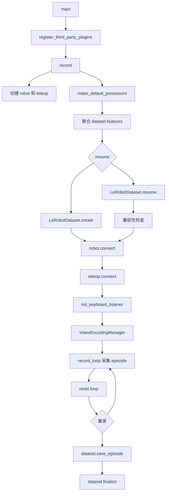
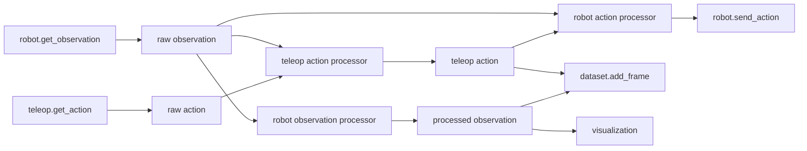

# lerobot-record 架构流程

## 入口

- CLI：`lerobot-record`
- `pyproject.toml` 映射：`lerobot.scripts.lerobot_record:main`
- 源码：`src/lerobot/scripts/lerobot_record.py`
- 参数解析：`draccus` parser

## 作用

`lerobot-record` 用遥操作器控制机器人并采集数据集。当前版本明确要求 `teleop`，不再作为 policy 部署入口；策略驱动机器人请使用 `lerobot-rollout`。

## 配置对象

`RecordConfig`：

- `robot: RobotConfig`
- `dataset: DatasetRecordConfig`
- `teleop: TeleoperatorConfig | None = None`，实际运行必须提供
- `display_data: bool = False`
- `display_mode: str = "rerun"`，也支持 `foxglove`
- `display_ip`、`display_port`
- `display_compressed_images`
- `play_sounds: bool = True`
- `resume: bool = False`

## 顶层流程



## record_loop 数据流



## 数据集 feature 构建

创建数据集前，脚本会把两类 feature 合并：

- action feature：来自 `robot.action_features`，再经过 `teleop_action_processor` 聚合。
- observation feature：来自 `robot.observation_features`，再经过 `robot_observation_processor` 聚合。

这一步决定了 parquet、视频、meta 信息中保存哪些列。

## episode 控制

采集循环受以下事件控制：

- 正常采集：达到 `dataset.episode_time_s` 后保存。
- reset：episode 之间执行不保存的 reset 控制段。
- rerecord：清空 episode buffer，重新采当前 episode。
- stop：停止整个录制任务。

这些事件来自键盘监听器。

## 架构要点

- `resume=true` 会打开已有数据集并做 robot/dataset 兼容性检查。
- 非 resume 时会拒绝 `eval_` 前缀的数据集名，因为该前缀保留给 policy evaluation。
- 视频编码由 `VideoEncodingManager` 统一管理，支持 streaming encoding。
- `display_data=true` 时可以把 observation/action 推到 Rerun 或 Foxglove。
- `finally` 中会 `dataset.finalize()`、停止可视化、断开设备。

## 典型使用

```bash
lerobot-record \
  --robot.type=so101_follower \
  --robot.port=/dev/ttyACM0 \
  --robot.id=my_follower \
  --teleop.type=so101_leader \
  --teleop.port=/dev/ttyACM1 \
  --teleop.id=my_leader \
  --dataset.repo_id=you/dataset \
  --dataset.num_episodes=50 \
  --dataset.fps=30 \
  --dataset.single_task="pick up the object" \
  --display_data=true
```

