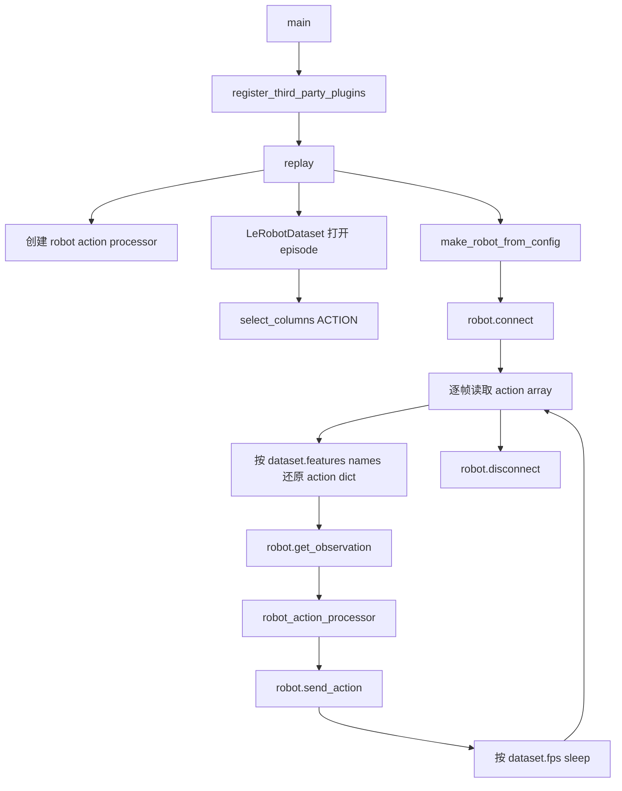

# lerobot-replay 架构流程

## 入口

- CLI：`lerobot-replay`
- `pyproject.toml` 映射：`lerobot.scripts.lerobot_replay:main`
- 源码：`src/lerobot/scripts/lerobot_replay.py`
- 参数解析：`draccus` parser

## 作用

`lerobot-replay` 把已有 LeRobotDataset 里某个 episode 的 action 逐帧发送给真实机器人。它常用于验证数据集动作是否合理，或复现实验轨迹。

## 配置对象

`DatasetReplayConfig`：

- `repo_id: str`
- `episode: int`
- `root: str | Path | None = None`
- `fps: int = 30`

`ReplayConfig`：

- `robot: RobotConfig`
- `dataset: DatasetReplayConfig`
- `play_sounds: bool = True`

## 流程



## 架构要点

- replay 只使用数据集中的 `action` 列，不读取 teleop。
- 发送前仍会读取当前 robot observation，因为默认 robot action processor 接口接收 `(action, observation)`。
- 节奏使用 `dataset.fps`，不是配置中的 `dataset.fps` 字段；数据集实际 FPS 是最终依据。
- 它不会保存新数据，也不会自动检查环境是否已经 reset 到 episode 初始状态。

## 典型使用

```bash
lerobot-replay \
  --robot.type=so101_follower \
  --robot.port=/dev/ttyACM0 \
  --robot.id=my_follower \
  --dataset.repo_id=you/dataset \
  --dataset.episode=0
```

## 使用风险

- replay 会真实驱动机械臂，请确保工作空间安全。
- 数据集动作和当前 robot 标定、关节命名必须一致。
- 如果数据集是相对动作或经过特殊处理，必须确认当前 processor 能正确转换。

