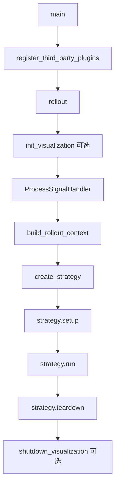

# lerobot-rollout 架构流程

## 入口

- CLI：`lerobot-rollout`
- `pyproject.toml` 映射：`lerobot.scripts.lerobot_rollout:main`
- 源码：`src/lerobot/scripts/lerobot_rollout.py`
- 主要实现：`src/lerobot/rollout`
- 配置：`RolloutConfig`
- 参数解析：`draccus` parser

更完整的展开版见仓库根目录的 `LEROBOT_ROLLOUT_ARCHITECTURE.md`。

## 作用

`lerobot-rollout` 是真实机器人 policy 部署和评测入口。它把训练好的 policy、robot、processor、inference backend、rollout strategy 组装起来，驱动机械臂执行任务，并可选择记录 rollout 数据。

## 顶层流程



## build_rollout_context 负责什么

上下文构建通常包含：

- 创建并连接 robot。
- 加载 policy checkpoint。
- 创建 policy preprocessor 和 postprocessor。
- 创建 robot observation/action processor。
- 创建 inference backend：sync 或 RTC。
- 创建可选 dataset recorder。
- 绑定 task、fps、duration、rename_map、display 配置。

## strategy 负责什么

`create_strategy(cfg.strategy)` 根据 `--strategy.type` 创建运行策略。策略决定 rollout 如何开始、如何结束、是否记录、是否有人类接管、是否分 episode。

常见策略：

- `base`：基础部署或评测。
- `sentry`：带安全/接管语义的运行。
- `highlight`：高亮或筛选片段式记录。
- `episodic`：按 episode 组织 rollout。
- `dagger`：策略和人工接管数据采集。

具体可用策略以当前 `src/lerobot/rollout` 注册为准。

## inference.type

`--inference.type=sync`：

- 每个控制 tick 调一次 policy。
- 架构简单，适合推理足够快的 policy。

`--inference.type=rtc`：

- RTC 是 Real-Time Chunking。
- 后台异步生成 action chunk，控制环按 `execution_horizon` 消费动作。
- 适合 SmolVLA、Pi0、Pi0.5 等单次推理慢但能输出动作块的 VLA。

## 典型使用

```bash
lerobot-rollout \
  --strategy.type=base \
  --policy.path=/root/code/lerobot/output_lerobot_train/checkpoints/last/pretrained_model \
  --robot.type=so101_follower \
  --robot.port=/dev/ttyACM0 \
  --robot.id=my_follower \
  --task="clean the table" \
  --fps=30 \
  --duration=30 \
  --device=cuda \
  --display_data=true \
  --rename_map='{"observation.images.front":"observation.images.camera1","observation.images.wrist":"observation.images.camera2"}'
```

RTC：

```bash
lerobot-rollout \
  --strategy.type=base \
  --inference.type=rtc \
  --inference.rtc.execution_horizon=10 \
  --policy.path=/path/to/pretrained_model \
  --robot.type=so101_follower \
  --robot.port=/dev/ttyACM0 \
  --robot.id=my_follower \
  --task="clean the table"
```

## 和 record/eval 的区别

- `lerobot-record`：人工遥操作采集真实数据。
- `lerobot-eval`：仿真环境评估 policy。
- `lerobot-rollout`：真实机器人上运行 policy。

