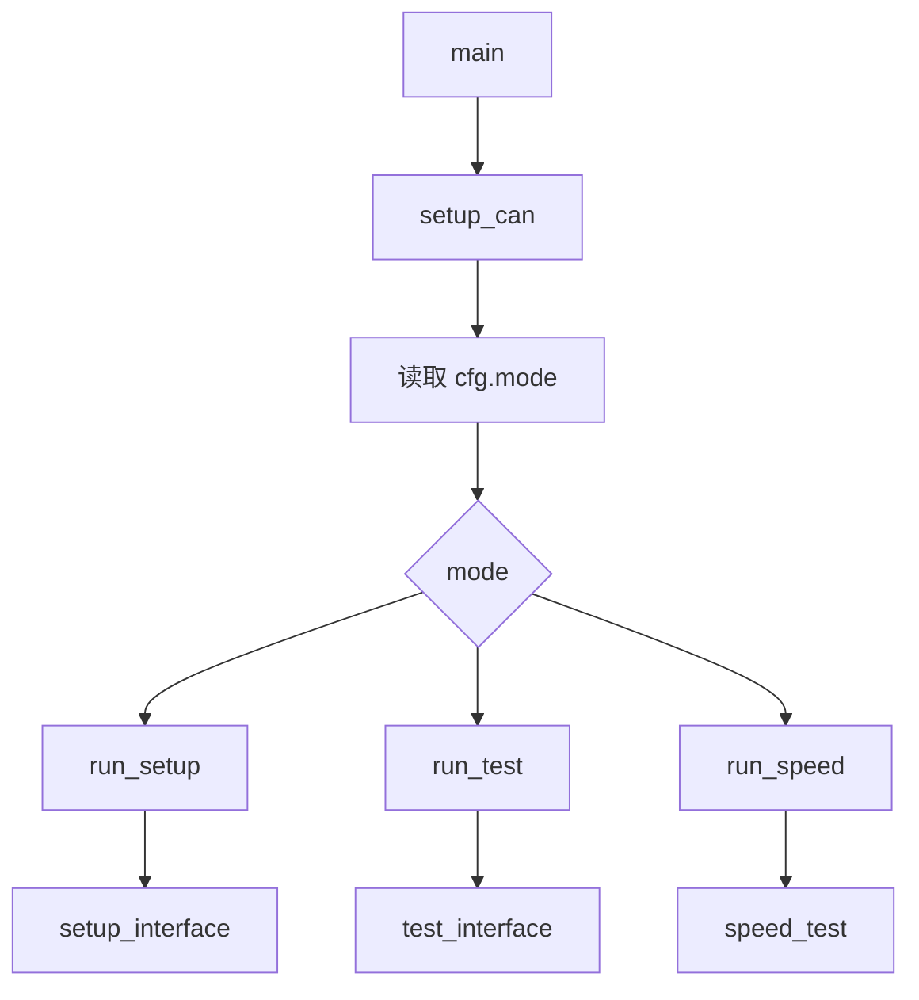

# lerobot-setup-can 架构流程

## 入口

- CLI：`lerobot-setup-can`
- `pyproject.toml` 映射：`lerobot.scripts.lerobot_setup_can:main`
- 源码：`src/lerobot/scripts/lerobot_setup_can.py`
- 配置：`CANSetupConfig`
- 参数解析：`draccus.wrap()`

## 作用

`lerobot-setup-can` 用于配置和调试 Damiao motors 等 CAN 总线设备，常见于 OpenArm 一类硬件。它支持三种模式：配置接口、测试电机响应、测试通信速度。

## 配置对象

`CANSetupConfig`：

- `mode: str = "test"`
- `interfaces: str = "can0"`
- `bitrate: int = 1000000`
- `data_bitrate: int = 5000000`
- `use_fd: bool = True`
- `motor_ids: list[int] = 0x01..0x08`
- `timeout: float = 1.0`
- `speed_iterations: int = 100`

`get_interfaces()` 会把 `interfaces` 按逗号拆成列表。

## 模式分发



## setup 模式


该模式会调用 `sudo ip link ...`，需要 Linux socketcan 环境。

## test 模式


## speed 模式

`speed_test()` 会先找一个有响应的 motor，然后连续发送测试帧，统计通信耗时。

## 典型使用

配置 CAN FD：

```bash
lerobot-setup-can --mode=setup --interfaces=can0,can1,can2,can3
```

测试电机：

```bash
lerobot-setup-can --mode=test --interfaces=can0
```

速度测试：

```bash
lerobot-setup-can --mode=speed --interfaces=can0 --speed_iterations=100
```

## 架构要点

- 该脚本直接操作系统 CAN interface，不经过 LeRobot robot abstraction。
- 依赖 `python-can` 和 Linux `ip` 命令。
- `use_fd=true` 时会按 CAN FD 配置 data bitrate。
- 没有电机响应时，优先检查电源、CANH/CANL/GND、bitrate、interface 是否 UP。

