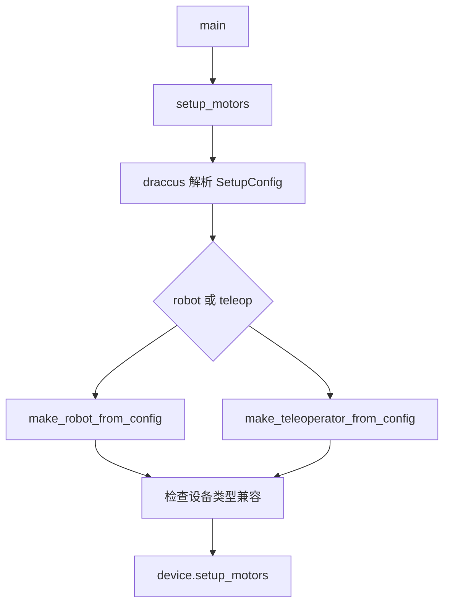
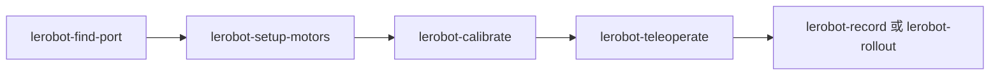

# lerobot-setup-motors 架构流程

## 入口

- CLI：`lerobot-setup-motors`
- `pyproject.toml` 映射：`lerobot.scripts.lerobot_setup_motors:main`
- 源码：`src/lerobot/scripts/lerobot_setup_motors.py`
- 参数解析：`draccus.wrap()`

## 作用

`lerobot-setup-motors` 用来初始化电机总线上的电机 ID、波特率等底层参数。它通常只在新装配机械臂、换电机、重刷电机配置时使用。

## 配置对象

`SetupConfig` 与标定类似，要求在 `robot` 和 `teleop` 中二选一：

- `robot: RobotConfig | None`
- `teleop: TeleoperatorConfig | None`

脚本会验证设备类型是否属于支持 `setup_motors()` 的兼容列表。

## 流程



## 架构要点

- 该脚本调用设备类自己的 `setup_motors()`，具体协议由各 robot/teleoperator 实现。
- 兼容设备包括 Koch、SO100/SO101、OpenArm、LeKiwi 等相关配置。
- 它不是通用串口扫描工具；找端口请先用 `lerobot-find-port`。
- 它不是标定工具；机械零位和范围标定请用 `lerobot-calibrate`。

## 典型使用

```bash
lerobot-setup-motors \
  --robot.type=so101_follower \
  --robot.port=/dev/ttyACM0 \
  --robot.id=my_follower
```

## 推荐顺序



