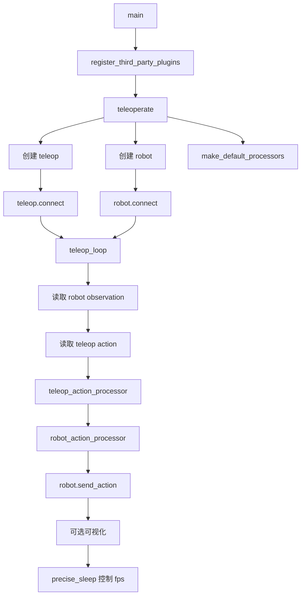
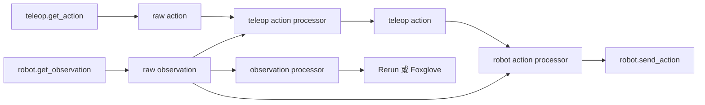

# lerobot-teleoperate 架构流程

## 入口

- CLI：`lerobot-teleoperate`
- `pyproject.toml` 映射：`lerobot.scripts.lerobot_teleoperate:main`
- 源码：`src/lerobot/scripts/lerobot_teleoperate.py`
- 参数解析：`draccus.wrap()`

## 作用

`lerobot-teleoperate` 用遥操作器实时控制机器人。它不保存数据集，主要用于调试连接、检查标定、验证动作方向和关节范围。

## 配置对象

`TeleoperateConfig`：

- `teleop: TeleoperatorConfig`
- `robot: RobotConfig`
- `fps: int = 60`
- `teleop_time_s: float | None = None`
- `display_data: bool = False`
- `display_mode: str = "rerun"`，也支持 `foxglove`
- `display_ip`、`display_port`
- `display_compressed_images`

## 主流程



## 控制环数据流



## 架构要点

- 默认 processor 是 identity 风格，但保留了动作、观测转换扩展点。
- `unitree_g1` 这类设备可以在 loop 中把 observation 反馈给 teleop。
- `precise_sleep()` 用来把循环限制在目标 FPS。
- `display_data=true` 时会读取并展示观测，还会在终端打印动作 norm。
- `finally` 中关闭可视化并断开 teleop、robot。

## 典型使用

```bash
lerobot-teleoperate \
  --teleop.type=so101_leader \
  --teleop.port=/dev/ttyACM1 \
  --teleop.id=my_leader \
  --robot.type=so101_follower \
  --robot.port=/dev/ttyACM0 \
  --robot.id=my_follower \
  --fps=30 \
  --display_data=true
```

## 和 record 的区别

- `lerobot-teleoperate`：只控制，不保存。
- `lerobot-record`：同样用 teleop 控制，但会把 observation/action 写成 LeRobotDataset。

