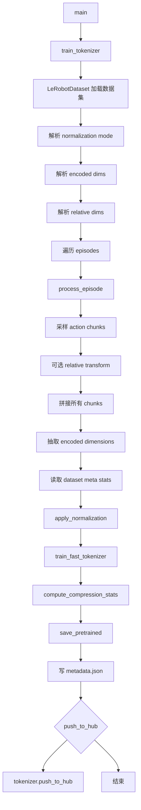

# lerobot-train-tokenizer 架构流程

## 入口

- CLI：`lerobot-train-tokenizer`
- `pyproject.toml` 映射：`lerobot.scripts.lerobot_train_tokenizer:main`
- 源码：`src/lerobot/scripts/lerobot_train_tokenizer.py`
- 配置：`TokenizerTrainingConfig`
- 参数解析：`draccus`

## 作用

`lerobot-train-tokenizer` 从 LeRobotDataset 的 action chunks 中训练 FAST tokenizer。它主要服务于需要离散动作 token 的模型，把连续动作片段转换成更紧凑的 token 表示。

## 配置对象

关键字段：

- `repo_id`、`root`
- `action_horizon`
- `max_episodes`
- `sample_fraction`
- `encoded_dims`
- `relative_dims`
- `use_relative_transform`
- `state_key`
- `normalization_mode`
- `vocab_size`
- `scale`
- `output_dir`
- `push_to_hub`
- `hub_repo_id`
- `hub_private`

## 流程



## action chunk 处理

每个 episode 会被切成长度为 `action_horizon` 的未来动作片段。脚本按 `sample_fraction` 采样片段，避免大数据集全部用于 tokenizer 训练。

如果启用 `use_relative_transform`，指定的 `relative_dims` 会做：

```text
relative_action[dim] = action[dim] - state[dim]
```

这适合某些模型只编码相对末端位姿或相对关节变化的场景。

## normalization

脚本会读取 `dataset.meta.stats[ACTION]`，只抽取 `encoded_dims` 对应维度的统计量，再按 `normalization_mode` 对 action chunks 做归一化。

支持的模式来自 `NormalizationMode`，常见值包括：

- `MEAN_STD`
- `MIN_MAX`
- `QUANTILES`
- `QUANTILE10`
- `IDENTITY`

## 输出内容

本地输出目录包含：

- tokenizer 文件，来自 `tokenizer.save_pretrained(output_path)`
- `metadata.json`，记录训练数据、维度、归一化、压缩率等信息

可选上传到 Hugging Face Hub model repo。

## 典型使用

```bash
lerobot-train-tokenizer \
  --repo_id=you/dataset \
  --action_horizon=10 \
  --encoded_dims=0:6,7:23 \
  --normalization_mode=QUANTILES \
  --vocab_size=1024 \
  --output_dir=./fast_tokenizer_you_dataset
```

