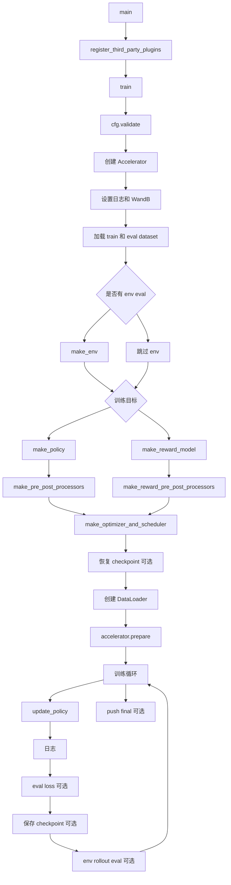
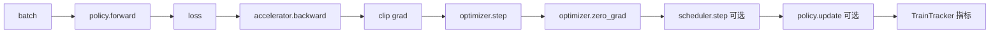

# lerobot-train 架构流程

## 入口

- CLI：`lerobot-train`
- `pyproject.toml` 映射：`lerobot.scripts.lerobot_train:main`
- 源码：`src/lerobot/scripts/lerobot_train.py`
- 顶层配置：`TrainPipelineConfig`
- 参数解析：`draccus` parser

## 作用

`lerobot-train` 是训练主入口。它负责把 dataset、policy 或 reward model、processor、optimizer、scheduler、Accelerate、checkpoint、WandB、环境评估串成一个完整训练任务。

## 顶层流程



## 单步训练 update_policy



如果启用 sample weighting，`policy.forward(batch, reduction="none")` 会先返回 per-sample loss，再由 sample weighter 聚合。

## 关键组件

- dataset：`make_train_eval_datasets(cfg)` 创建训练集和 held-out eval dataset。
- policy：`make_policy(cfg.policy, ds_meta=dataset.meta, ...)`。
- reward model：`make_reward_model(...)`，与 policy 训练共用主循环。
- processor：`make_pre_post_processors()` 或 `make_reward_pre_post_processors()`。
- optimizer/scheduler：`make_optimizer_and_scheduler(cfg, policy)`。
- env eval：`make_env()` + `eval_policy_all()`。
- distributed：`Accelerator.prepare()` 包装 model、optimizer、dataloader、scheduler。

## 多 GPU 架构

`lerobot-train` 自身不手动 spawn 多进程，多 GPU 由 Accelerate 负责：

```bash
accelerate launch --multi_gpu --num_processes=4 $(which lerobot-train) \
  --policy.path=lerobot/smolvla_base \
  --dataset.repo_id=you/dataset \
  --batch_size=8
```

注意：`batch_size` 是每个进程看到的 batch 规模，实际全局 batch 约等于 `batch_size * num_processes`。

## checkpoint 逻辑

训练中保存 checkpoint 时会写：

- policy 或 reward model 权重
- 训练配置
- optimizer state
- scheduler state
- processor 状态
- batch size 和 world size 等恢复信息

`resume=true` 时会读取 checkpoint 中保存的训练步数，并恢复 optimizer/scheduler。FSDP 下 optimizer state 需要在 `accelerator.prepare()` 后用 collective 方式加载。

## eval 逻辑

有两类 eval：

- eval loss：在 held-out eval dataset 上跑 `policy.forward(eval_batch)`，计算 loss。
- env rollout eval：把 policy 放到仿真环境中执行动作，用 `eval_policy_all()` 统计 reward、success、video。

## 架构要点

- 只有 main process 负责打印配置、写 checkpoint、上传 Hub、记录 WandB、执行有副作用的 env eval。
- 训练设备以 `accelerator.device` 为准。
- `policy.dtype` 会映射到 Accelerate mixed precision：`bfloat16 -> bf16`，`float16 -> fp16`，`float32 -> no`。
- PEFT 只支持 policy 训练，不支持 reward model 训练。
- `rename_map` 会影响 policy 和 dataset feature 的对齐，尤其是相机名不同的场景。

## 典型使用

```bash
lerobot-train \
  --policy.path=lerobot/smolvla_base \
  --dataset.repo_id=you/dataset \
  --output_dir=./outputs/train \
  --job_name=smolvla_finetune \
  --policy.device=cuda \
  --steps=40000 \
  --batch_size=8
```

