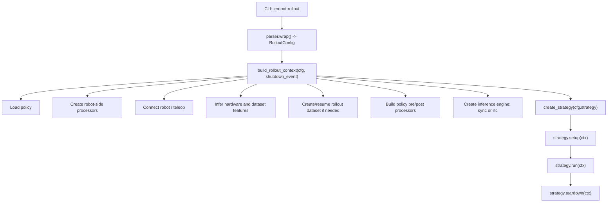
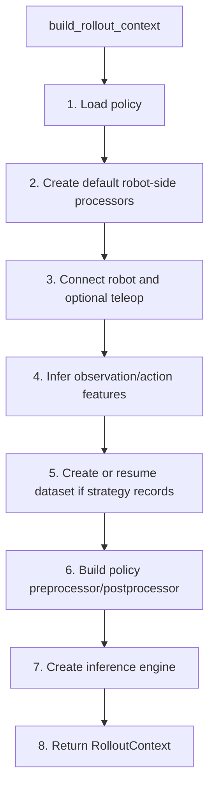
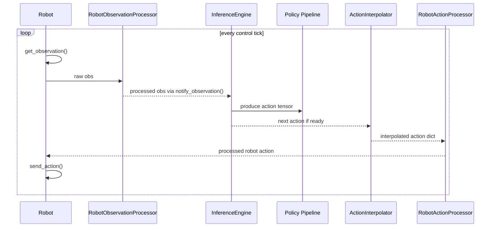
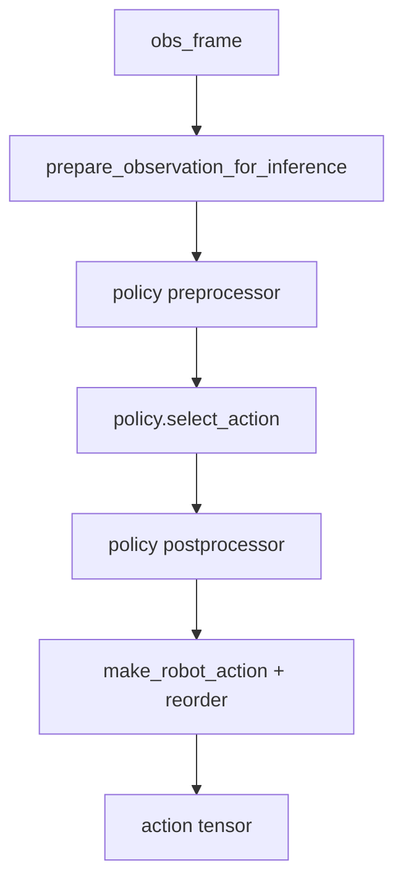
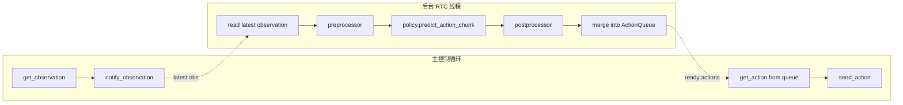
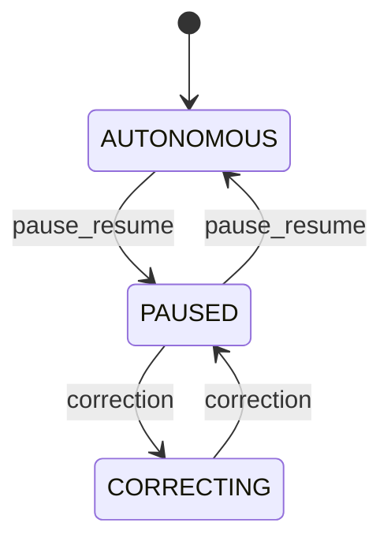

# `lerobot-rollout` 架构流程详解

本文面向已经能跑通训练、准备把 policy 部署到真实机械臂上的读者，解释当前代码库中 `lerobot-rollout` 的架构、调用链和关键扩展点。

相关源码入口：

- CLI 入口：`src/lerobot/scripts/lerobot_rollout.py`
- 顶层配置：`src/lerobot/rollout/configs.py`
- 上下文装配：`src/lerobot/rollout/context.py`
- 推理后端：`src/lerobot/rollout/inference/`
- 执行策略：`src/lerobot/rollout/strategies/`
- 线程安全机器人包装：`src/lerobot/rollout/robot_wrapper.py`
- Highlight 缓冲区：`src/lerobot/rollout/ring_buffer.py`

---

## 1. 一句话概览

`lerobot-rollout` 是 LeRobot 的真实机器人 policy deployment 引擎。

它做的事可以拆成三层：

1. 加载训练好的 policy 和 processor。
2. 连接真实机器人、相机和可选 teleoperator。
3. 按某种 rollout strategy 循环执行：读 observation -> policy 推理 action -> 后处理 -> 发给机器人，并可选记录 rollout 数据。

最小命令形态：

```bash
lerobot-rollout \
  --strategy.type=base \
  --policy.path=/path/to/checkpoints/last/pretrained_model \
  --robot.type=so101_follower \
  --robot.port=/dev/ttyACM0 \
  --robot.id=my_follower \
  --robot.cameras="{ front: {type: opencv, index_or_path: 0, width: 640, height: 480, fps: 30}}" \
  --task="pick up the cube" \
  --duration=30 \
  --device=cuda
```

---

## 2. 总体模块关系



核心设计是把“装配”和“运行”分开：

- `context.py` 负责一次性创建所有运行时依赖，输出 `RolloutContext`。
- `strategies/` 只负责控制循环语义，例如纯自主、连续记录、DAgger 等。
- `inference/` 只负责 action 生产方式，例如同步推理或 RTC 后台推理。

这样 strategy 不需要知道 policy 是同步算出来的还是后台线程提前算好的。

---

## 3. CLI 入口流程

入口函数在 `src/lerobot/scripts/lerobot_rollout.py`。

主流程：

```python
@parser.wrap()
def rollout(cfg: RolloutConfig):
    init_logging()

    if cfg.display_data:
        init_visualization(...)

    signal_handler = ProcessSignalHandler(...)
    shutdown_event = signal_handler.shutdown_event

    ctx = build_rollout_context(cfg, shutdown_event)
    strategy = create_strategy(cfg.strategy)

    try:
        strategy.setup(ctx)
        strategy.run(ctx)
    finally:
        strategy.teardown(ctx)
        if cfg.display_data:
            shutdown_visualization(...)
```

注意几点：

- `@parser.wrap()` 会用 draccus 解析 CLI，并自动构造 `RolloutConfig`。
- `ProcessSignalHandler` 提供统一的退出信号，策略循环会轮询 `shutdown_event`。
- 只有 `build_rollout_context()` 会真正触碰 policy、机器人、dataset 等重资源。
- `strategy.setup/run/teardown` 是所有策略的统一生命周期。

---

## 4. 配置层：`RolloutConfig`

`RolloutConfig` 是顶层配置，位于 `src/lerobot/rollout/configs.py`。

主要字段：

| 字段 | 作用 |
| --- | --- |
| `robot` | 真实机器人配置，例如 `--robot.type=so101_follower` |
| `teleop` | 可选 teleoperator，例如 DAgger 或 episodic reset 阶段使用 |
| `policy` | 从 `--policy.path` 加载出的 policy config |
| `strategy` | rollout 策略，`base/sentry/highlight/dagger/episodic` |
| `inference` | 推理后端，`sync/rtc` |
| `dataset` | 记录 rollout 数据时使用的 dataset config |
| `fps` | 控制循环目标频率 |
| `duration` | rollout 总时长，`0` 表示无限运行 |
| `device` | policy 推理设备 |
| `task` | 语言任务描述 |
| `display_data` | 是否可视化 observation/action |
| `rename_map` | 把机器人 observation key 映射到 policy 训练时的 key |
| `return_to_initial_position` | 退出时是否回到启动时关节位置 |
| `use_torch_compile` | 是否编译 policy 推理函数 |

### 4.1 Strategy 配置

所有策略配置继承 `RolloutStrategyConfig`，通过 `draccus.ChoiceRegistry` 注册：

| CLI | Config 类 | 语义 |
| --- | --- | --- |
| `--strategy.type=base` | `BaseStrategyConfig` | 只自主执行，不记录数据 |
| `--strategy.type=sentry` | `SentryStrategyConfig` | 连续自主执行并持续记录，定期上传 |
| `--strategy.type=highlight` | `HighlightStrategyConfig` | 平时只缓存，按键保存 highlight 片段 |
| `--strategy.type=dagger` | `DAggerStrategyConfig` | 人类介入修正，采集 DAgger/RaC 数据 |
| `--strategy.type=episodic` | `EpisodicStrategyConfig` | 类似 `lerobot-record` 的 episode/reset 流程 |

### 4.2 Inference 配置

推理配置在 `src/lerobot/rollout/inference/factory.py` 中注册：

| CLI | Engine | 语义 |
| --- | --- | --- |
| `--inference.type=sync` | `SyncInferenceEngine` | 控制线程里每 tick 同步调用 policy |
| `--inference.type=rtc` | `RTCInferenceEngine` | 后台线程异步生成 action chunks，主线程从队列取动作 |

---

## 5. `RolloutConfig.__post_init__`

`RolloutConfig.__post_init__()` 负责早期校验和 policy config 加载。

关键行为：

1. 检查策略和参数是否兼容。
   - DAgger 必须有 `--teleop.type`。
   - `sentry/highlight/dagger/episodic` 需要 `--dataset.repo_id`。
   - `base` 不允许传 dataset，因为 base 不记录数据。
2. 对某些策略强制或建议 streaming encoding。
   - `sentry` 强制 `dataset.streaming_encoding=True`。
   - `highlight` 强制 `dataset.streaming_encoding=True`。
   - DAgger 只有 `record_autonomous=true` 时强制 streaming。
3. 从 `--policy.path` 加载 policy config。
   - 调用 `PreTrainedConfig.from_pretrained(policy_path, cli_overrides=...)`。
   - 设置 `self.policy.pretrained_path = policy_path`。
4. 同步 `task` 和 `dataset.single_task`。
5. 推断 device。
   - 如果未显式传 `--device`，优先用 policy config 里的 device。
   - 如果不可用，则自动选择 torch device。

这一层还没有连接机器人。连接硬件被延后到 `build_rollout_context()`，这样 policy path 或配置错误会先失败，不会让机器人乱动。

---

## 6. 上下文装配：`build_rollout_context`

`build_rollout_context()` 是整个架构的中心。它把 policy、hardware、processors、dataset、inference engine 统一组装成 `RolloutContext`。

`RolloutContext` 包含五个子上下文：

| 子上下文 | 内容 |
| --- | --- |
| `RuntimeContext` | 原始 cfg 和 shutdown event |
| `HardwareContext` | `ThreadSafeRobot`、teleop、启动时初始关节位置 |
| `PolicyContext` | policy、policy preprocessor、postprocessor、inference engine |
| `ProcessorContext` | robot/teleop 侧 processors |
| `DatasetContext` | rollout dataset、feature schema、action key 顺序 |

### 6.1 装配顺序



### 6.2 Policy 加载

步骤：

1. 根据 `cfg.policy.type` 找到 policy class。
2. 如果是 PEFT，先读 adapter config，再加载 base policy 和 adapter。
3. 否则直接：

```python
policy = policy_class.from_pretrained(policy_config.pretrained_path, config=policy_config)
```

4. 如果启用 RTC，会把 `cfg.inference.rtc` 注入到 `policy.config.rtc_config`，并调用 `policy.init_rtc_processor()`。
5. `policy.to(cfg.device)`，再 `policy.eval()`。

### 6.3 Robot-side processors

这里的 processors 不是 policy 的 pre/post processor，而是机器人侧的处理流水线：

| Processor | 方向 | 作用 |
| --- | --- | --- |
| `teleop_action_processor` | teleop action -> robot action-like dict | 处理人类遥操作输入 |
| `robot_action_processor` | policy/teleop action -> robot send_action input | 发给机器人前的 action 处理 |
| `robot_observation_processor` | raw robot observation -> policy/dataset observation | 处理相机、关节等 observation |

默认由 `make_default_processors()` 创建。

### 6.4 连接硬件

连接顺序：

1. `make_robot_from_config(cfg.robot)`
2. `robot.connect()`
3. `robot.get_observation()` 记录初始关节位置
4. 包装成 `ThreadSafeRobot`
5. 如果有 teleop，则 `make_teleoperator_from_config(cfg.teleop)` 并 connect

`ThreadSafeRobot` 用一个 lock 包住：

- `get_observation()`
- `send_action()`

原因是 RTC 模式会有后台 inference 线程，主线程也会读写机器人，必须序列化硬件 I/O。

### 6.5 Feature 推断与 action key 对齐

Rollout 需要在三种 feature 空间之间对齐：

1. 硬件 feature：来自 `robot.observation_features` 和 `robot.action_features`。
2. dataset feature：记录 rollout 数据时的 schema。
3. policy feature：训练时 policy config 里保存的输入/输出 feature。

关键处理：

- observation 只保留相机特征和 `.pos` 关节特征。
- action 只保留 `.pos` 关节 action。
- 用 `aggregate_pipeline_dataset_features()` 经过 robot-side processor 后得到 dataset feature。
- 用 `_resolve_action_key_order()` 确定 policy 输出 tensor 到 robot action dict 的 key 顺序。

如果没有 `rename_map`，会检查 policy 期待的视觉 key 和机器人提供的视觉 key 是否匹配。

例如你的 SmolVLA 训练时使用：

```bash
--rename_map='{"observation.images.front":"observation.images.camera1","observation.images.wrist":"observation.images.camera2"}'
```

部署时也建议显式传同样的 `--rename_map`，这样机器人提供的 `front/wrist` 会进入 policy 前被改成 `camera1/camera2`。

### 6.6 Dataset 创建

只有这些策略会创建 dataset：

- `sentry`
- `highlight`
- `dagger`
- `episodic`

`base` 策略不记录数据，所以不创建 dataset。

如果创建新 dataset：

1. repo 名必须以 `rollout_` 开头。
2. `cfg.dataset.stamp_repo_id()` 会追加时间戳，避免覆盖旧 session。
3. 调用 `LeRobotDataset.create(...)`。
4. 如果是 DAgger，会额外加入 `intervention: bool` feature。

如果 `--resume=true`，则走 `LeRobotDataset.resume(...)`。

### 6.7 Policy pre/post processors

这一步调用：

```python
make_pre_post_processors(
    policy_cfg=policy_config,
    pretrained_path=cfg.policy.pretrained_path,
    dataset_stats=dataset_stats,
    preprocessor_overrides={
        "device_processor": {"device": cfg.device},
        "rename_observations_processor": {"rename_map": cfg.rename_map},
    },
)
```

含义：

- 从 checkpoint 加载训练时保存的 processor pipeline。
- 用当前部署环境覆盖 device。
- 用当前 CLI 传入的 `rename_map` 覆盖 observation rename。
- 如果当前策略创建了 dataset，会把 dataset stats 传入；否则常见部署只依赖 checkpoint 自带 processor。

### 6.8 Inference engine 创建

最后调用 `create_inference_engine()`：

- `sync` -> `SyncInferenceEngine`
- `rtc` -> `RTCInferenceEngine`

两个 engine 实现同一个接口：

```python
start()
stop()
reset()
get_action(obs_frame) -> torch.Tensor | None
notify_observation(obs)
pause()
resume()
ready
failed
```

所以 strategy 可以统一调用，不关心背后是同步还是异步。

---

## 7. 控制循环的公共数据流

不管是 base、sentry、highlight、episodic 还是 dagger，自主 policy 控制时都会走类似的数据流：



源码中公共 helper 是 `send_next_action()`：

1. 如果 interpolator 需要新 action：
   - 用 `build_dataset_frame(features, obs_processed, prefix="observation")` 构造 policy 输入帧。
   - 调用 `engine.get_action(obs_frame)`。
   - 如果得到 action tensor，就加入 `ActionInterpolator`。
2. 从 interpolator 取当前 tick 应该发送的 action。
3. 按 `ordered_action_keys` 转成 action dict。
4. 经过 `robot_action_processor`。
5. 调用 `robot.send_action()`。

`ActionInterpolator` 的作用是把 policy 输出的低频 action 平滑插值到控制频率，受 `--interpolation_multiplier` 控制。

---

## 8. 推理后端

### 8.1 SyncInferenceEngine

`sync` 是默认推理后端。

每次 `get_action(obs_frame)` 都在控制线程里完整执行：



特点：

- 简单直接。
- 对 ACT 这类推理快的模型很合适。
- 如果 policy 慢，控制循环会被阻塞，机器人可能卡顿。
- 当前实现不支持带 relative-action processor 的 policy，会在 context build 阶段拒绝。

### 8.2 RTCInferenceEngine

`rtc` 是 Real-Time Chunking，适合 SmolVLA、Pi0、Pi0.5 这类 VLA/flow-matching policy。

它把推理拆成两个线程：



关键机制：

- `start()` 启动后台线程。
- 主循环每 tick 调 `notify_observation(obs_processed)` 更新最新 observation。
- 后台线程看到 queue 不满时，调用 `policy.predict_action_chunk(...)` 生成一段动作。
- 动作 chunk 通过 `ActionQueue.merge(...)` 合并进共享队列。
- 主循环通过 `get_action()` 弹出下一步 action。

RTC 会估计模型推理延迟：

```python
delay = ceil(latency / time_per_chunk)
```

然后把：

- `inference_delay`
- `prev_chunk_left_over`

传给 policy，让新 chunk 和未执行完的旧 chunk 做一致性约束。

常用参数：

| 参数 | 作用 |
| --- | --- |
| `--inference.rtc.execution_horizon=10` | 新旧 chunk 平滑/一致的步数 |
| `--inference.rtc.max_guidance_weight=10.0` | 约束新 chunk 不要突然偏离旧 chunk 的强度 |
| `--inference.queue_threshold=30` | queue 小于等于该阈值时后台线程继续补动作 |

经验：

- 机器人抖：提高 `execution_horizon` 或 `max_guidance_weight`。
- 机器人反应慢：降低 `execution_horizon`。
- SmolVLA 真机部署优先试 RTC。

---

## 9. Strategy 详解

所有策略继承 `RolloutStrategy`，生命周期一致：

```python
strategy.setup(ctx)
strategy.run(ctx)
strategy.teardown(ctx)
```

公共能力由 `RolloutStrategy` 提供：

- `_init_engine(ctx)`：创建 interpolator，reset/start inference engine。
- `_process_observation_and_notify(...)`：处理 observation，并通知 inference engine。
- `_handle_warmup(...)`：处理 torch.compile warmup。
- `_teardown_hardware(...)`：停止 engine、可选回初始位置、断开机器人和 teleop。
- `_log_telemetry(...)`：可视化 observation/action。

### 9.1 BaseStrategy

`--strategy.type=base`

用途：只让 policy 驱动机器人，不记录数据。

循环：

1. `engine.resume()`
2. 读 robot observation。
3. 处理 observation 并通知 engine。
4. 调 `send_next_action()`。
5. 可视化 telemetry。
6. sleep 到目标 FPS。

适合：

- 第一次测试训练好的模型。
- 不想产生 rollout dataset。
- 快速验证相机、task、rename_map 和 checkpoint 是否匹配。

### 9.2 SentryStrategy

`--strategy.type=sentry`

用途：长时间自主运行，持续记录，周期性自动上传。

特点：

- 强制 streaming video encoding，避免视频编码阻塞控制循环。
- 根据视频大小估计 episode 切分时长。
- 每段 episode 自动 `dataset.save_episode()`。
- 每 N 个 episode 后后台上传 Hub。
- policy/RTC 状态跨 episode 保留，因为它代表一段连续运行被切片。

适合：

- 长时间部署。
- 记录 autonomous rollout 数据。
- 让机器人边跑边积累评估或再训练数据。

### 9.3 HighlightStrategy

`--strategy.type=highlight`

用途：机器人一直自主跑，但只保存你按键标记的片段。

机制：

- `RolloutRingBuffer` 持续缓存最近 N 秒 telemetry。
- 按 save key：
  1. 把 ring buffer 里的历史帧刷入 dataset。
  2. 开始 live recording。
- 再按 save key：
  1. 保存当前 episode。
  2. 回到 ring buffer 模式。
- 按 push key 后台上传。

适合：

- 只想保存有价值片段。
- 机器人长时间运行但大部分数据不值得存。
- 做 failure/highlight 数据挖掘。

### 9.4 EpisodicStrategy

`--strategy.type=episodic`

用途：类似 `lerobot-record` 的 episode/reset 流程，但 episode 由 policy 驱动。

流程：

1. 每个 episode 开始时 reset engine 和 interpolator。
2. policy 控制机器人，持续 `dataset.add_frame(...)`。
3. episode 结束后进入 reset phase。
4. reset phase：
   - 有 teleop：teleop 驱动机器人复位环境。
   - 无 teleop：可选回到初始关节位置。
5. 保存 episode。

键盘事件：

- 右箭头：提前结束当前 episode 或 reset。
- 左箭头：丢弃当前 episode 并重录。
- ESC：停止 session。

适合：

- 严格按 episode 评估 policy。
- 每次 rollout 后需要手动重置桌面、物体、场景。
- 想保存结构化 eval dataset。

### 9.5 DAggerStrategy

`--strategy.type=dagger`

用途：Human-in-the-Loop 数据采集。机器人先自主执行，人类在需要时接管修正。

状态机：



三种 phase：

| Phase | 谁控制机器人 | 是否记录 |
| --- | --- | --- |
| `AUTONOMOUS` | policy | 取决于 `record_autonomous` |
| `PAUSED` | 保持上一个 action/姿态 | 不记录 |
| `CORRECTING` | teleop | 记录，并标记 `intervention=True` |

两种记录模式：

| 参数 | 行为 |
| --- | --- |
| `--strategy.record_autonomous=false` | 只记录人工修正片段，每段 correction 是一个 episode |
| `--strategy.record_autonomous=true` | autonomous 和 correction 都记录，correction 帧带 `intervention=True` |

handover 逻辑：

- 从 autonomous 到 paused 时，先 pause engine。
- 如果 teleop 支持 feedback，会把 leader 平滑移动到 follower 当前姿态。
- 从 paused 到 correcting 时，人类接管。
- 从 paused 回 autonomous 时，reset engine 和 interpolator，再 resume。

适合：

- policy 已经能做一部分任务，但会在某些阶段失败。
- 想收集纠错数据，用于 DAgger/RaC 迭代训练。

---

## 10. Dataset 与 frame 写入

记录策略会把每一帧组织为 LeRobot dataset frame：

```python
obs_frame = build_dataset_frame(features, obs_processed, prefix=OBS_STR)
action_frame = build_dataset_frame(features, action_dict, prefix=ACTION)
frame = {**obs_frame, **action_frame, "task": task_str}
dataset.add_frame(frame)
```

DAgger 会额外加入：

```python
"intervention": np.array([True], dtype=bool)
```

episode 保存：

```python
dataset.save_episode()
```

最终清理：

```python
dataset.finalize()
dataset.push_to_hub(...)
```

为避免上传半写入 episode，`sentry/highlight/dagger` 都用：

- `ThreadPoolExecutor(max_workers=1)`
- `_episode_lock`

保证后台 push 和 episode save 不互相踩状态。

---

## 11. Processor 分层

`lerobot-rollout` 同时存在两类 processor。

### 11.1 Robot-side processors

创建于 `build_rollout_context()` 早期，处理硬件格式。

```text
raw robot observation
  -> robot_observation_processor
  -> policy/dataset observation

policy/teleop action
  -> robot_action_processor
  -> robot.send_action(...)
```

### 11.2 Policy pre/post processors

从 checkpoint 或 policy 类型构造，处理模型格式。

```text
dataset-style observation
  -> rename observations
  -> add batch / tokenize task / move device / normalize
  -> policy
  -> unnormalize / move cpu
  -> action tensor
```

部署时常见最重要的 processor override 是：

```bash
--rename_map='{"observation.images.front":"observation.images.camera1"}'
```

因为真实相机名经常和训练 checkpoint 里保存的视觉 key 不一致。

---

## 12. `rename_map` 在 rollout 中的位置

`rename_map` 用来把机器人提供的 observation key 改成 policy 期待的 key。

例如机器人 camera config：

```bash
--robot.cameras="{ front: {...}, wrist: {...} }"
```

机器人 observation key 通常会变成：

```text
observation.images.front
observation.images.wrist
```

如果训练时 SmolVLA checkpoint 期待：

```text
observation.images.camera1
observation.images.camera2
```

就需要：

```bash
--rename_map='{"observation.images.front":"observation.images.camera1","observation.images.wrist":"observation.images.camera2"}'
```

rollout 中它影响两处：

1. 跳过/替代视觉 feature mismatch 校验。
2. 覆盖 policy preprocessor 中的 `rename_observations_processor`。

---

## 13. 退出与安全

退出路径统一在 strategy `teardown()` 中：

1. 停止 inference engine。
2. 等待后台 push 或线程结束。
3. finalize dataset。
4. 可选 push to Hub。
5. 如果 `return_to_initial_position=true`，平滑回到启动时关节位置。
6. disconnect robot。
7. disconnect teleop。

建议真机首次部署：

```bash
--duration=10 \
--display_data=true
```

确认方向、相机、任务描述和 action 都合理后再延长时间。

---

## 14. 常用命令模板

### 14.1 纯自主测试

```bash
lerobot-rollout \
  --strategy.type=base \
  --policy.path=/root/code/lerobot/output_lerobot_train/checkpoints/last/pretrained_model \
  --robot.type=so101_follower \
  --robot.port=/dev/ttyACM0 \
  --robot.id=my_follower \
  --robot.cameras="{ front: {type: opencv, index_or_path: 0, width: 640, height: 480, fps: 30}, wrist: {type: opencv, index_or_path: 1, width: 640, height: 480, fps: 30}}" \
  --task="clean up the table" \
  --duration=30 \
  --device=cuda \
  --display_data=true \
  --rename_map='{"observation.images.front":"observation.images.camera1","observation.images.wrist":"observation.images.camera2"}'
```

### 14.2 SmolVLA + RTC

```bash
lerobot-rollout \
  --strategy.type=base \
  --inference.type=rtc \
  --inference.rtc.execution_horizon=10 \
  --inference.rtc.max_guidance_weight=10.0 \
  --policy.path=/root/code/lerobot/output_lerobot_train/checkpoints/last/pretrained_model \
  --robot.type=so101_follower \
  --robot.port=/dev/ttyACM0 \
  --robot.id=my_follower \
  --robot.cameras="{ front: {type: opencv, index_or_path: 0, width: 640, height: 480, fps: 30}, wrist: {type: opencv, index_or_path: 1, width: 640, height: 480, fps: 30}}" \
  --task="clean up the table" \
  --duration=30 \
  --device=cuda \
  --display_data=true \
  --rename_map='{"observation.images.front":"observation.images.camera1","observation.images.wrist":"observation.images.camera2"}'
```

### 14.3 Episodic eval dataset

```bash
lerobot-rollout \
  --strategy.type=episodic \
  --policy.path=/root/code/lerobot/output_lerobot_train/checkpoints/last/pretrained_model \
  --robot.type=so101_follower \
  --robot.port=/dev/ttyACM0 \
  --robot.id=my_follower \
  --robot.cameras="{ front: {type: opencv, index_or_path: 0, width: 640, height: 480, fps: 30}, wrist: {type: opencv, index_or_path: 1, width: 640, height: 480, fps: 30}}" \
  --dataset.repo_id=${HF_USER}/rollout_eval_table_cleanup \
  --dataset.single_task="clean up the table" \
  --dataset.num_episodes=10 \
  --dataset.episode_time_s=30 \
  --dataset.reset_time_s=10 \
  --device=cuda \
  --rename_map='{"observation.images.front":"observation.images.camera1","observation.images.wrist":"observation.images.camera2"}'
```

---

## 15. 扩展点

### 15.1 新增 strategy

步骤：

1. 在 `configs.py` 新增 `RolloutStrategyConfig` 子类并注册：

```python
@RolloutStrategyConfig.register_subclass("my_strategy")
@dataclass
class MyStrategyConfig(RolloutStrategyConfig):
    ...
```

2. 在 `strategies/` 新增 `MyStrategy(RolloutStrategy)`。
3. 实现：

```python
setup(ctx)
run(ctx)
teardown(ctx)
```

4. 在 `strategies/factory.py` 的 `create_strategy()` 中分发。

如果只是改变记录/交互语义，优先新增 strategy，而不是改 inference engine。

### 15.2 新增 inference backend

步骤：

1. 在 `inference/factory.py` 新增 `InferenceEngineConfig` 子类并注册。
2. 新增一个 `InferenceEngine` 实现。
3. 在 `create_inference_engine()` 中分发。

只要实现同一接口，现有 strategy 不需要改。

### 15.3 新增 robot-side processor

如果需要把 policy action 映射到特殊硬件控制格式，优先扩展：

- `robot_action_processor`
- `robot_observation_processor`
- `teleop_action_processor`

这样可以保持 policy 和 strategy 不变。

---

## 16. Debug 观察点

### 16.1 确认 context 装配成功

日志中应看到：

```text
Loading policy from ...
Policy loaded: type=..., device=...
Connecting robot (...)
Robot connected
Rollout context assembled successfully
Rollout setup complete, starting rollout...
```

### 16.2 确认 feature mismatch

如果报：

```text
Visual feature mismatch between policy and robot hardware
```

通常是相机 key 不一致。检查：

- `--robot.cameras` 里的名字。
- checkpoint 的 `config.json` 中 `input_features`。
- 是否传了正确 `--rename_map`。

### 16.3 控制循环慢

如果日志出现：

```text
Record loop is running slower ... than the target FPS
```

常见原因：

- 相机 FPS 跟不上。
- policy 推理太慢，SmolVLA/Pi0 建议用 `--inference.type=rtc`。
- CPU 饱和，视频编码或可视化占用太高。
- `display_data=true` 通过远程连接传原始图像太重，可试 `--display_compressed_images=true`。

### 16.4 RTC 后台线程错误

RTC 线程连续失败会设置 `failed` 并触发顶层 shutdown event。重点看：

```text
RTC inference error
Fatal error in RTC thread
```

常见原因：

- observation key 不匹配。
- action 维度不匹配。
- device/dtype 不兼容。
- RTC 参数过激导致 policy 内部异常。

---

## 17. 架构设计要点

`lerobot-rollout` 的代码组织有几个清晰的边界：

1. CLI 不做业务逻辑，只解析配置、初始化可视化、调度生命周期。
2. `RolloutConfig` 做早期校验和 policy config 加载。
3. `build_rollout_context()` 做一次性依赖装配，且先加载 policy、后连接硬件。
4. Strategy 只表达“怎么运行和记录”，不关心 action 是 sync 还是 RTC 产生的。
5. Inference engine 只表达“怎么产生 action”，不关心 rollout 是否记录数据。
6. Processor 分机器人侧和 policy 侧，避免把硬件 key、dataset key、policy key 混在一起。
7. Dataset 写入和 Hub push 在记录策略内完成，`base` 策略保持无副作用。

这个设计使得部署路径可以按需求替换：

- 换机器人：改 `--robot.*` 和 robot-side processor。
- 换 policy：改 `--policy.path`。
- 换推理方式：改 `--inference.type`。
- 换记录方式：改 `--strategy.type`。
- 相机名不一致：改 `--rename_map`。

